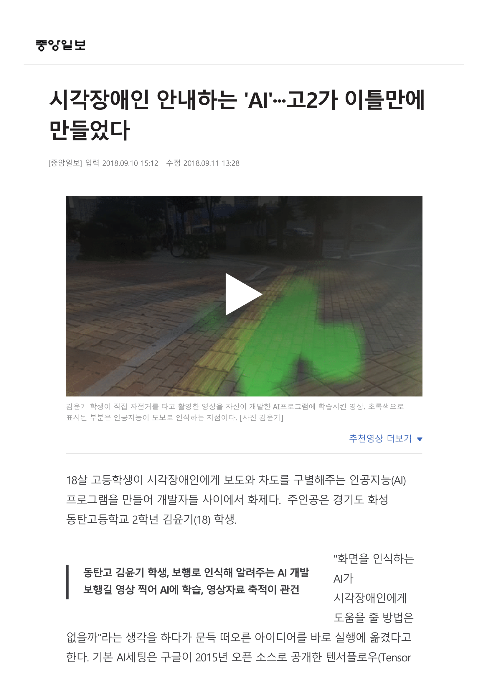
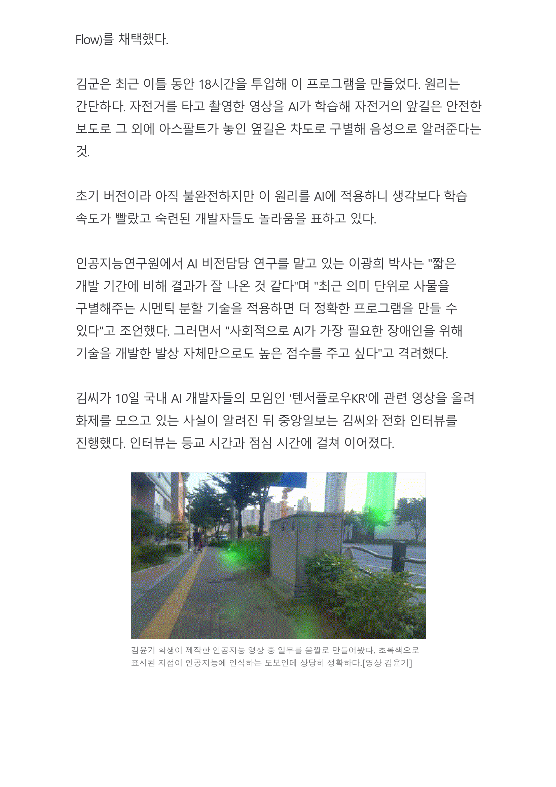
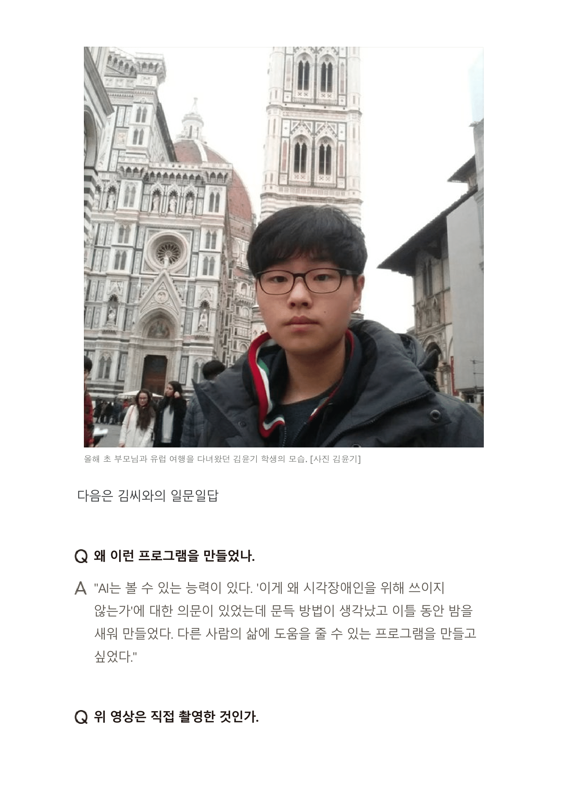
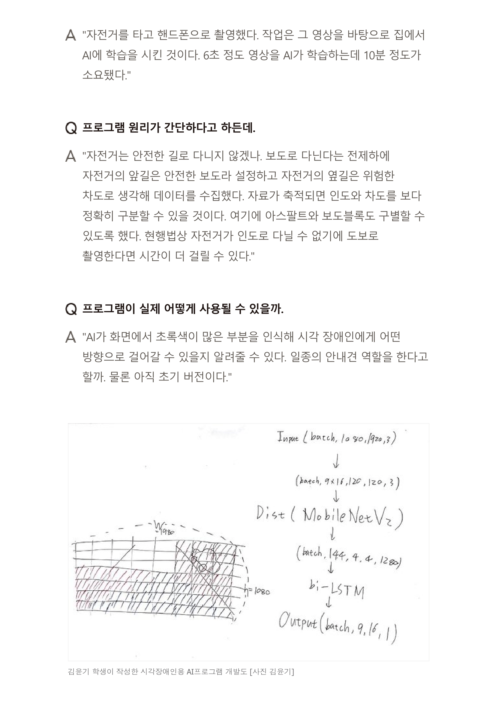
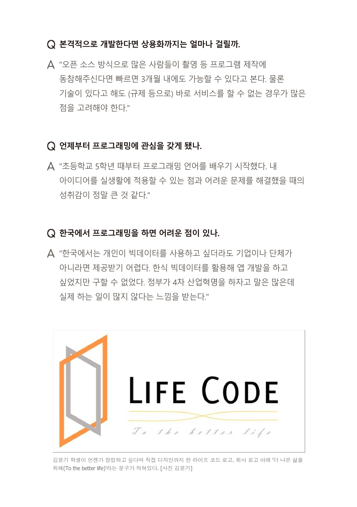
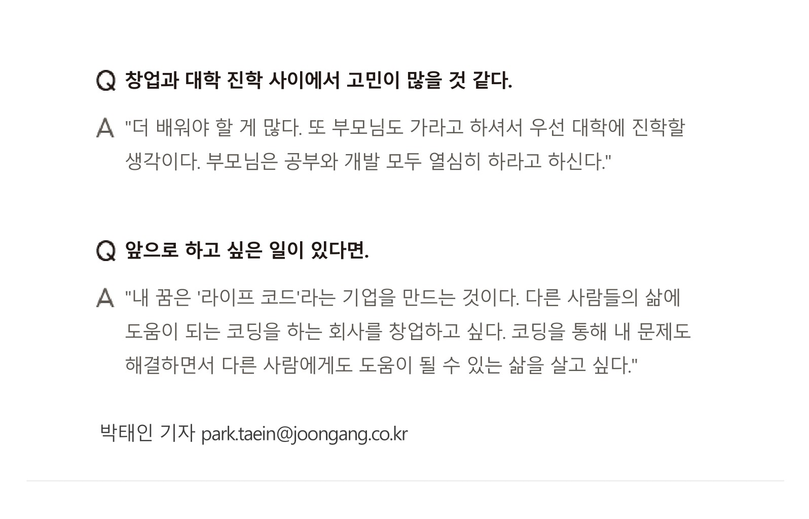
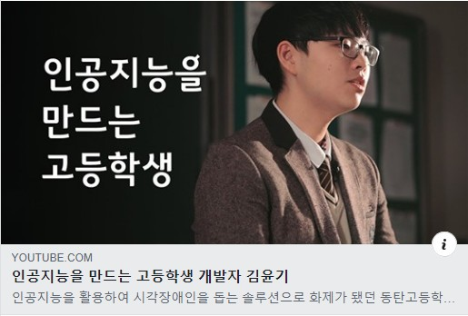

## 시각장애인 안내하는 AI
### "인공지능이 볼 수 있는 능력을 가졌는데 시각 장애인을 위해 사용될 수 없을까?"

https://news.naver.com/main/read.nhn?mode=LSD&mid=sec&sid1=102&oid=025&aid=0002848946&fbclid=IwAR3baXH1uDyqVX7rgfKh4dBTP5jr_J4Bkmfyye6W_zFGtuBAngpdQFztz_E

## 음성을 수화로 번역해주는 인공지능
### 뉴스에 나오는 수화를 학습, 수화가 없는 영상에도 수화를 넣어줄 수 있을 것.

#### KCC 제출 논문

## 꿈과 목표에 대한 이야기

